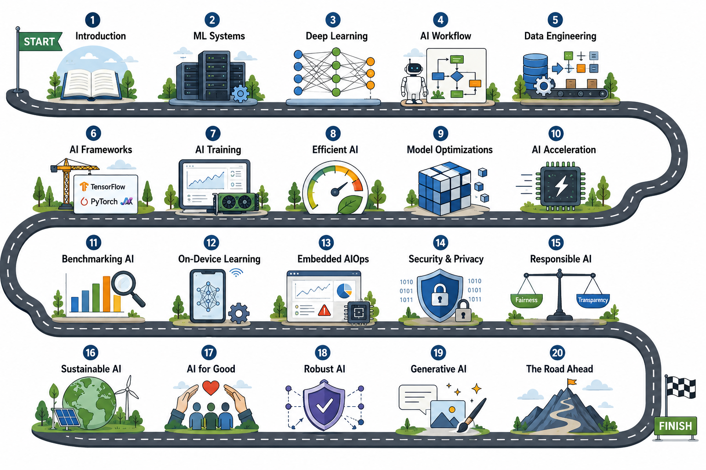

# 🚀 AI-ML Roadmap Repository

<p align="center">
  
</p>

<p align="center">
  <b>A complete roadmap of my Artificial Intelligence & Machine Learning learning journey</b>
</p>

---

# 📌 About

This repository documents my complete journey of learning and building in **Artificial Intelligence & Machine Learning**, following a structured roadmap from Python fundamentals to advanced real-world AI applications.

It includes:

* 📚 Learning notes
* 🧠 AI/ML concepts
* ⚙️ Hands-on implementations
* 🚀 Real-world projects
* 📊 Data analysis & visualization
* 🤖 Deep learning applications

---

# 🧠 AI-ML Roadmap

## 🔹 Phase 0: Core Python

### Topics Covered

* List & Dictionary Comprehensions
* Lambda Functions
* map(), filter()
* File Handling (CSV, JSON)
* Object-Oriented Programming (OOP)
* Error Handling
* Python Modules & Packages

📁 Folder: `Core_Python`

### Mini Projects

* CSV Analyzer
* Log Parser
* File Organizer

---

## 📊 Phase 1: Data Foundations

### Technologies

* NumPy
* Pandas

### Concepts

* Numerical Computing
* Data Cleaning
* Data Manipulation
* DataFrames & Arrays
* Statistical Operations

📁 Projects:

* Student Grade Analyzer
* CSV Data Processing Tool
* Sales Data Analysis

---

## 📈 Phase 2: Data Visualization

### Libraries

* Matplotlib
* Seaborn

### Concepts

* Line Charts
* Histograms
* Heatmaps
* Boxplots
* Correlation Visualization

📁 Projects:

* COVID Data Visualization
* Stock Market Trend Analysis
* Statistical Plot Dashboard

---

## 🤖 Phase 3: Machine Learning

### ML Algorithms

* Linear Regression
* Logistic Regression
* Decision Trees
* Random Forest
* K-Means Clustering
* Support Vector Machines

### Concepts

* Feature Engineering
* Model Evaluation
* Train/Test Split
* Hyperparameter Tuning

📁 Projects:

* House Price Predictor
* Spam Email Classifier
* Customer Segmentation System

---

## 🧠 Phase 4: Deep Learning

### Topics

* Artificial Neural Networks
* CNN Basics
* RNN Basics
* Backpropagation
* Tensor Operations

### Frameworks

* TensorFlow
* PyTorch

📁 Projects:

* Digit Recognizer
* Image Classifier
* Basic Neural Network from Scratch

---

## 🧩 Phase 5: Specialization

### 🔤 Natural Language Processing (NLP)

* Text Preprocessing
* Tokenization
* Transformers
* Sentiment Analysis

### 👁 Computer Vision

* Image Processing
* OpenCV Basics
* Object Detection Concepts

### 🎬 Recommendation Systems

* Collaborative Filtering
* Content-Based Filtering

📁 Projects:

* AI Text Analyzer
* Movie Recommendation System
* Face Detection App

---

## ⚙️ Phase 6: Deployment & MLOps

### Topics

* Flask APIs
* FastAPI
* Model Deployment
* API Integration
* Docker Basics
* Model Serving

📁 Projects:

* ML Model API Deployment
* AI Web App
* Real-Time Prediction API

---

## 🏆 Phase 7: Advanced AI Projects

### Projects

* AI Chatbot (Knowledge-Based)
* Resume Screening System
* AI Recommendation Engine
* Financial Market Prediction
* AI Automation Tools

### Advanced Concepts

* Generative AI
* AI Optimization
* Efficient AI Systems
* Responsible AI
* AI Security & Privacy

---

# 🛠 Tech Stack

| Category         | Technologies        |
| ---------------- | ------------------- |
| Programming      | Python              |
| Data Analysis    | NumPy, Pandas       |
| Visualization    | Matplotlib, Seaborn |
| Machine Learning | scikit-learn        |
| Deep Learning    | TensorFlow, PyTorch |
| Deployment       | Flask, FastAPI      |
| Computer Vision  | OpenCV              |
| NLP              | Transformers, NLTK  |

---

# 📂 Repository Structure

```bash
AI-ML-Roadmap/
│
├── Core_Python/
├── Data_Foundations/
├── Data_Visualization/
├── Machine_Learning/
├── Deep_Learning/
├── NLP/
├── Computer_Vision/
├── Deployment/
├── Advanced_Projects/
├── assets/
│   └── ai-ml-roadmap.png
└── README.md
```

---

# 🎯 Goal

The main goal of this repository is to:

* Build strong AI/ML fundamentals
* Practice through real-world projects
* Learn scalable AI system development
* Explore advanced AI technologies
* Create a strong developer portfolio

---

# 🚀 Future Improvements

* Add more real-world datasets
* Build end-to-end AI products
* Deploy live AI applications
* Improve model accuracy & performance
* Add MLOps workflows
* Integrate Generative AI projects

---

# 🤝 Contribution

Contributions, suggestions, and improvements are welcome.

Feel free to:

* Fork the repository
* Open issues
* Submit pull requests
* Share feedback

---

# ⭐ Support

If you found this repository useful:

⭐ Star the repository
🍴 Fork it
📢 Share it with others

---

# 📬 Connect

Let's connect and grow together in the AI/ML journey 🚀
